# Leish! (leish.my) — Module Flow Diagrams

## Table of Contents

1. [Application Bootstrap & Request Lifecycle](#1-application-bootstrap--request-lifecycle)
2. [Authentication Module](#2-authentication-module)
3. [Middleware / Proxy](#3-middleware--proxy)
4. [Database Layer](#4-database-layer)
5. [Booking Module](#5-booking-module)
6. [Payment Module (Billplz)](#6-payment-module-billplz)
7. [Quote System](#7-quote-system)
8. [Email Module (Brevo)](#8-email-module-brevo)
9. [Loyalty / Rewards Module](#9-loyalty--rewards-module)
10. [Notifications Module](#10-notifications-module)
11. [Cloudinary (Image Storage)](#11-cloudinary-image-storage)
12. [Rate Limiting Module](#12-rate-limiting-module)
13. [Cron Jobs Module](#13-cron-jobs-module)
14. [Admin Dashboard](#14-admin-dashboard)
15. [Artist Dashboard](#15-artist-dashboard)
16. [Studio Dashboard](#16-studio-dashboard)
17. [Homepage & Public Pages](#17-homepage--public-pages)
18. [Search Module](#18-search-module)
19. [Favorites Module](#19-favorites-module)
20. [Reviews Module](#20-reviews-module)
21. [Events Module](#21-events-module)
22. [Subscription Module](#22-subscription-module)
23. [Referral Module](#23-referral-module)
24. [Contact / Inquiry Module](#24-contact--inquiry-module)
25. [Onboarding Flow](#25-onboarding-flow)
26. [Analytics Module](#26-analytics-module)
27. [URL Shortener (Cloudflare Worker)](#27-url-shortener-cloudflare-worker)
28. [Email Worker (Cloudflare)](#28-email-worker-cloudflare)

---

## 1. Application Bootstrap & Request Lifecycle

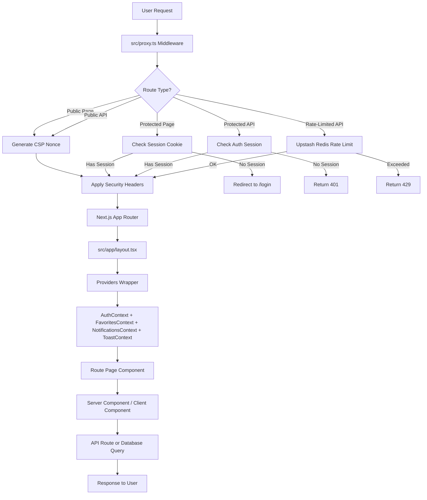

---

## 2. Authentication Module

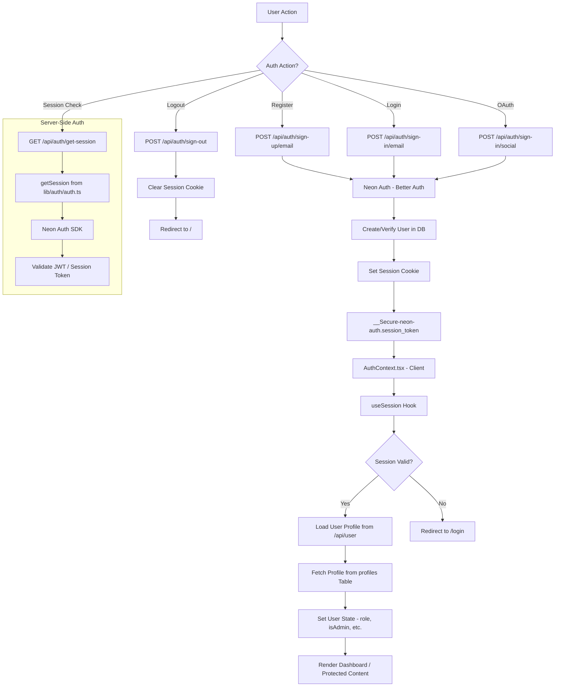

---

## 3. Middleware / Proxy

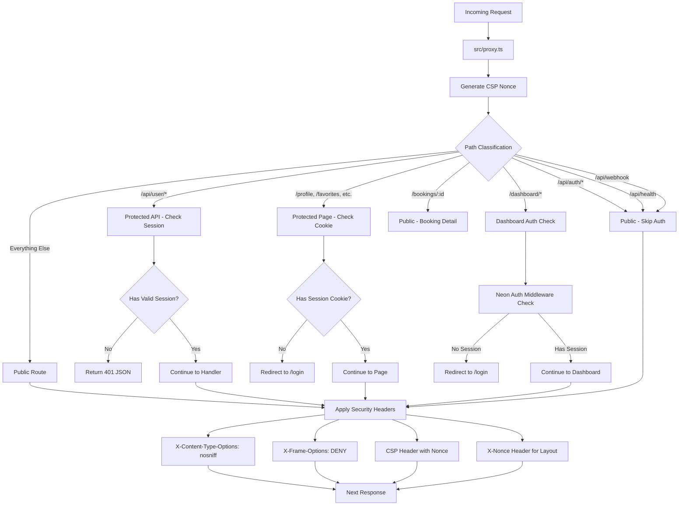

---

## 4. Database Layer

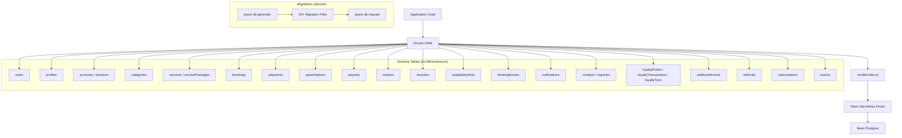

---

## 5. Booking Module

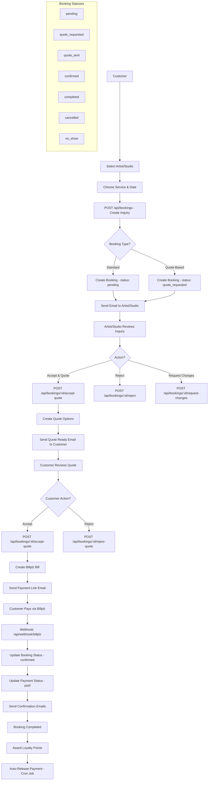

---

## 6. Payment Module (Billplz)

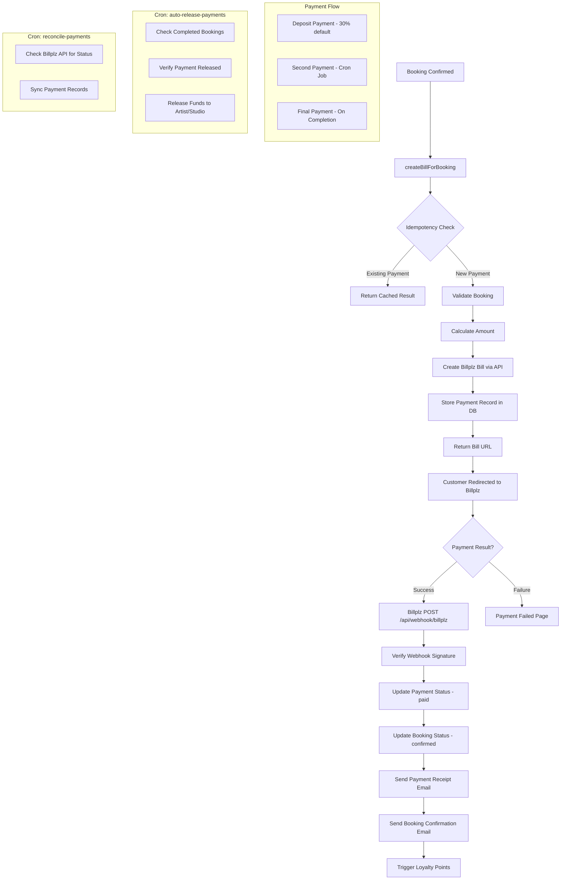

---

## 7. Quote System

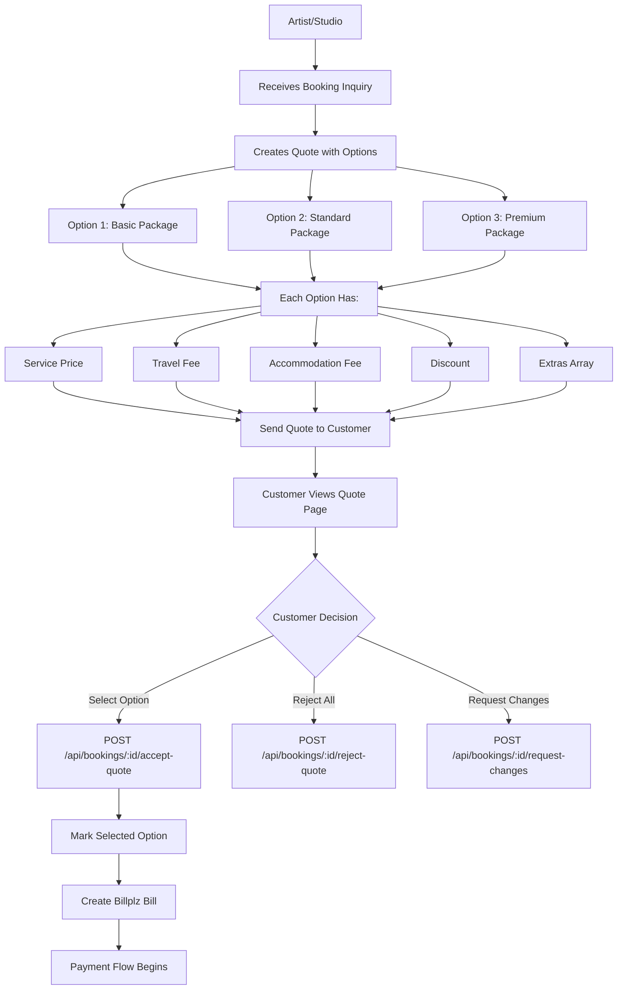

---

## 8. Email Module (Brevo)

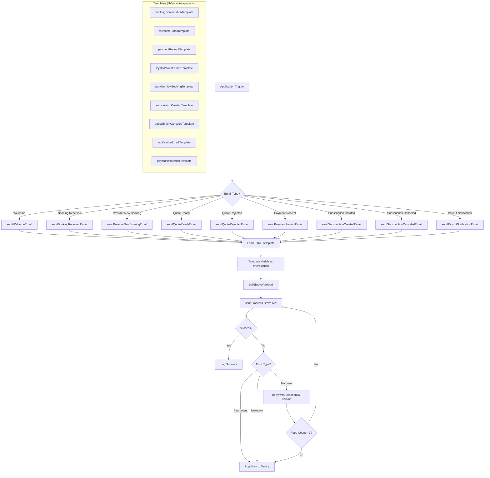

---

## 9. Loyalty / Rewards Module

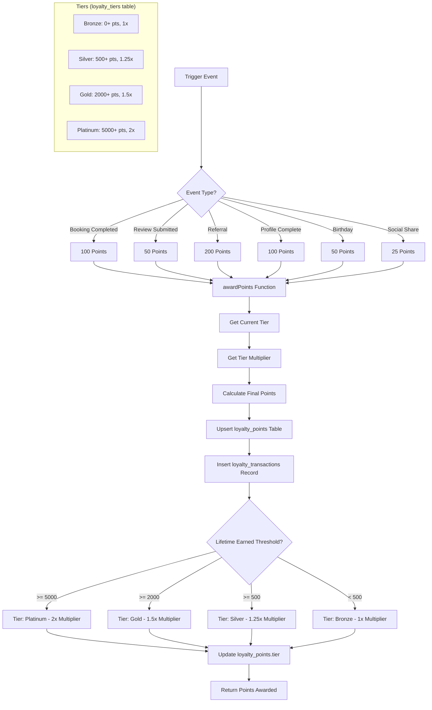

---

## 10. Notifications Module

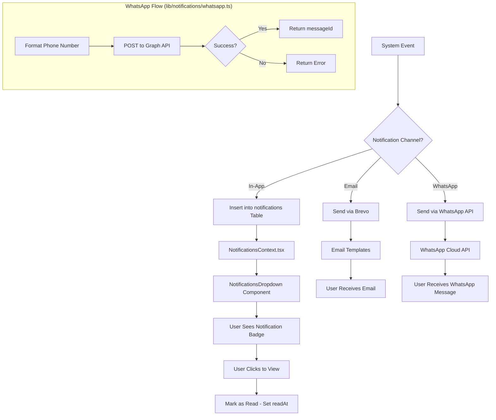

---

## 11. Cloudinary (Image Storage)

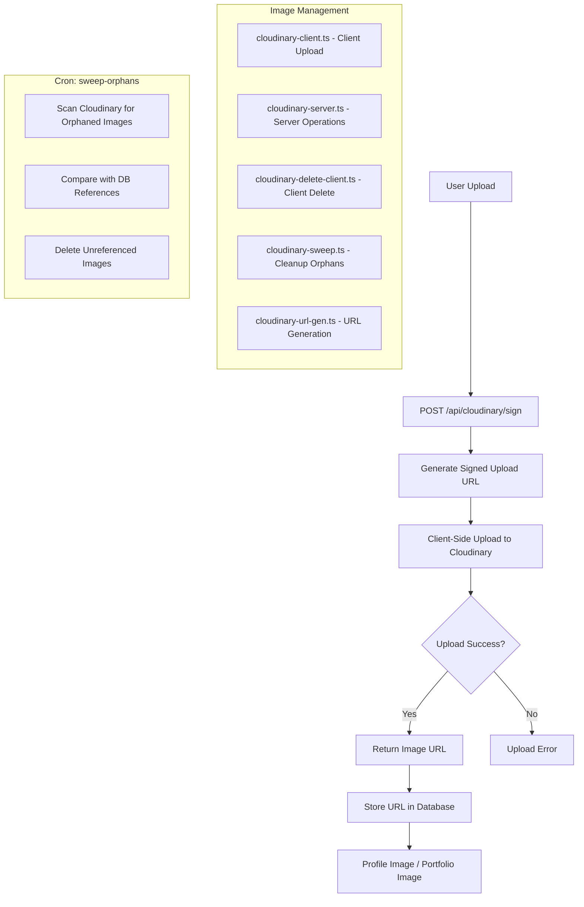

---

## 12. Rate Limiting Module

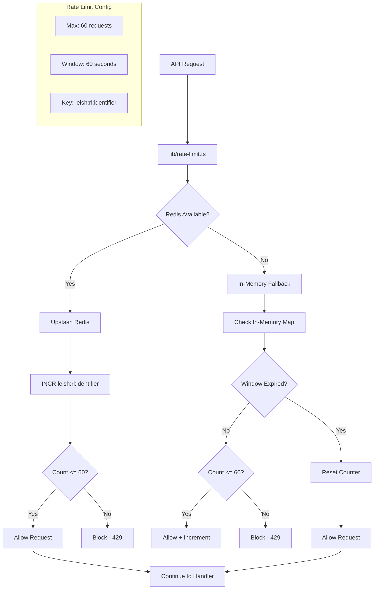

---

## 13. Cron Jobs Module

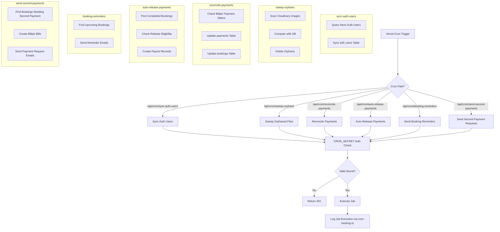

---

## 14. Admin Dashboard

```mermaid
flowchart TD
    A[Admin Login] --> B[/dashboard/admin]
    B --> C[Admin Layout - Auth Check]

    C --> D{Admin Section?}

    D -->|Overview| E[GET /api/admin - Stats]
    D -->|People| F[GET /api/admin/people - Users List]
    D -->|Moderation| G[GET /api/admin/moderation - Pending Profiles]
    D -->|Reports| H[GET /api/admin/reports - Analytics]
    D -->|Settings| I[GET /api/admin/settings - Config]

    E --> J[Dashboard Overview Cards]
    J --> K[Total Users, Bookings, Revenue]

    F --> L[User Management]
    L --> M[View / Edit / Delete Users]
    M --> N[Toggle Admin Status]
    M --> O[Change User Roles]

    G --> P[Profile Moderation Queue]
    P --> Q[Approve / Reject Profiles]
    Q --> R[Send Rejection Reason Email]

    H --> S[Revenue Reports]
    S --> T[Booking Analytics]
    T --> U[User Growth Charts]

    I --> V[System Settings]
    V --> W[Platform Configuration]
```

---

## 15. Artist Dashboard

```mermaid
flowchart TD
    A[Artist Login] --> B[/dashboard/artist]
    B --> C[Artist Layout - Auth Check]

    C --> D{Artist Section?}

    D -->|Overview| E[GET /api/user - Profile Stats]
    D -->|Bookings| F[GET /api/bookings - My Bookings]
    D -->|Services| G[GET /api/services - My Services]
    D -->|Portfolio| H[GET /api/cloudinary - My Images]
    D -->|Analytics| I[GET /api/analytics - Performance]
    D -->|Quotes| J[GET /api/bookings - Quote Requests]
    D -->|Share| K[Public Profile Link]

    E --> L[Profile Completion Status]
    L --> M[Quick Actions Cards]

    F --> N[Booking Management Table]
    N --> O[View Details]
    N --> P[Accept / Reject]
    N --> Q[Send Quote]

    G --> R[Service CRUD]
    R --> S[Add / Edit / Delete Services]
    S --> T[Set Pricing & Packages]

    H --> U[Portfolio Grid]
    U --> V[Upload Images via Cloudinary]
    U --> W[Reorder / Delete Images]

    I --> X[Booking Statistics]
    X --> Y[Revenue Charts]
    Y --> Z[Rating Summary]

    J --> AA[Quote Request List]
    AA --> AB[Create Quote with Options]
```

---

## 16. Studio Dashboard

```mermaid
flowchart TD
    A[Studio Login] --> B[/dashboard/studio]
    B --> C[Studio Layout - Auth Check]

    C --> D{Studio Section?}

    D -->|Calendar| E[GET /api/calendar - Schedule]
    D -->|Staff| F[GET /api/studios/staff - Staff List]
    D -->|Inventory| G[GET /api/inventory - Products]
    D -->|Finance| H[GET /api/finance - Revenue]
    D -->|Quotes| I[GET /api/bookings - Quote Requests]
    D -->|Share| J[Public Profile Link]

    E --> K[Calendar View]
    K --> L[View Bookings by Date]
    K --> M[Manage Availability Slots]

    F --> N[Staff Management]
    N --> O[Add / Edit Staff Members]
    N --> P[Assign Staff to Bookings]

    G --> Q[Inventory Management]
    Q --> R[Track Products & Supplies]
    Q --> S[Low Stock Alerts]

    H --> T[Financial Overview]
    T --> U[Revenue by Period]
    T --> V[Payout History]
    T --> W[Pending Payments]

    I --> X[Quote Management]
    X --> Y[Create Quotes with Options]
```

---

## 17. Homepage & Public Pages

```mermaid
flowchart TD
    A[User Visits /] --> B[src/app/page.tsx]
    B --> C[Server Component]

    C --> D[Fetch Data in Parallel]
    D --> E[Featured Artists]
    D --> F[Categories]
    D --> G[Testimonials]

    E --> H[GET /api/artists?featured=true]
    F --> I[GET /api/services - Categories]
    G --> J[Static Testimonials Data]

    H --> K[Render Hero Section]
    I --> L[Render Categories Grid]
    J --> M[Render Testimonials Carousel]

    K --> N[Search Bar Component]
    N --> O[ArtistSearchForm]
    O --> P[Search by Location / Category]

    subgraph "Public Pages"
        Q[/artists - Artist Listing]
        R[/studios - Studio Listing]
        S[/artists/:id - Artist Detail]
        T[/studios/:id - Studio Detail]
        U[/events - Events Listing]
        V[/contact - Contact Form]
        W[/faq - FAQ Page]
        X[/rewards - Rewards Info]
    end

    Q --> Y[GET /api/artists - List]
    R --> Z[GET /api/studios - List]
    S --> AA[GET /api/artists/:id - Detail]
    T --> AB[GET /api/studios/:id - Detail]
```

---

## 18. Search Module

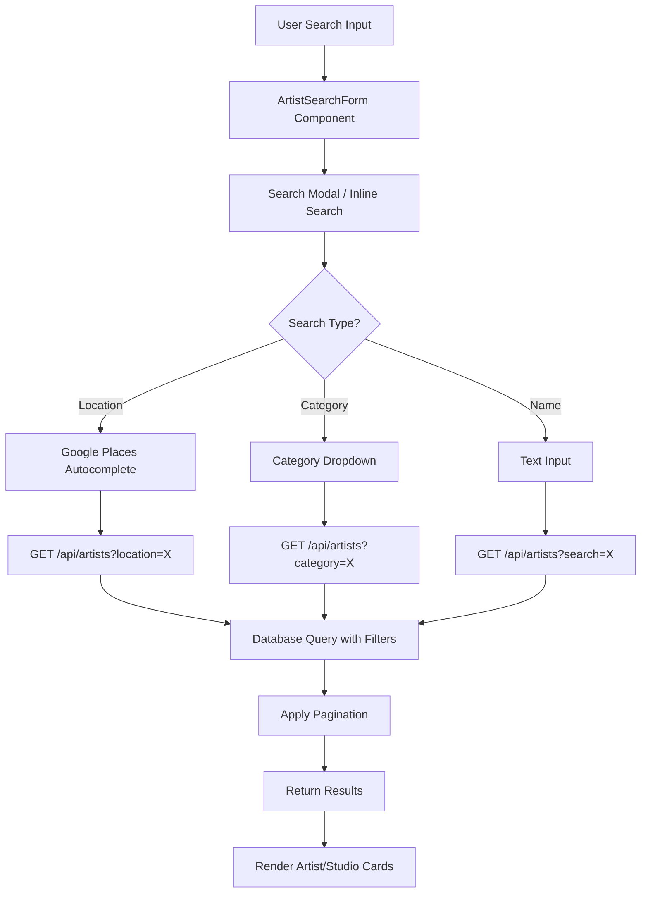

---

## 19. Favorites Module

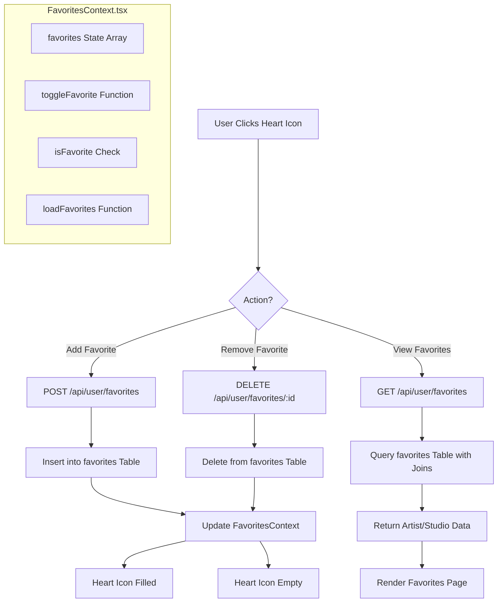

---

## 20. Reviews Module

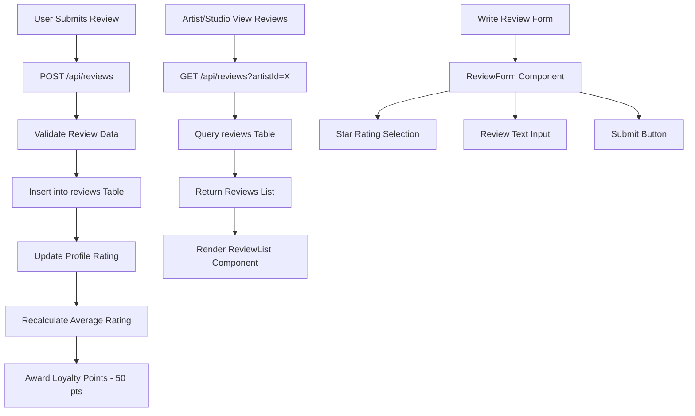

---

## 21. Events Module

```mermaid
flowchart TD
    A[Admin Creates Event] --> B[POST /api/events]
    B --> C[Insert into events Table]
    C --> D[Event Visible on /events]

    E[User Views Events] --> F[GET /api/events]
    F --> G[Query events Table]
    G --> H[Render Events Page]

    I[User RSVPs to Event] --> J[POST /api/events/:id/rsvp]
    J --> K[Store RSVP Record]
    K --> L[Send Confirmation Email]
```

---

## 22. Subscription Module

```mermaid
flowchart TD
    A[Artist/Studio] --> B[Subscribe to Leish Plus]
    B --> C[POST /api/subscriptions]
    C --> D[Create Subscription Record]
    D --> E[Send Subscription Created Email]
    E --> F[Unlock Premium Features]

    F --> G[Featured Listing]
    F --> H[Priority Support]
    F --> I[Advanced Analytics]

    J[Cancellation Request] --> K[POST /api/subscriptions/cancel]
    K --> L[Update Subscription Status]
    L --> M[Send Cancellation Email]
    M --> N[Revoke Premium Features]

    O[Cron: Check Expired Subscriptions] --> P[Auto-Downgrade]
```

---

## 23. Referral Module

```mermaid
flowchart TD
    A[User Shares Referral Link] --> B[Referral Code Generated]
    B --> C[New User Clicks Link]
    C --> D[Register with Referral Code]
    D --> E[POST /api/referrals]
    E --> F[Store Referral Record]

    F --> G{Referral Complete?}
    G -->|New User Books| H[Award 200 Points to Referrer]
    G -->|New User Registers| I[Award 50 Points to Referrer]

    H --> J[Update loyalty_points Table]
    I --> J
    J --> K[Send Referral Bonus Email]
```

---

## 24. Contact / Inquiry Module

```mermaid
flowchart TD
    A[User Fills Contact Form] --> B[POST /api/contact]
    B --> C[Validate Form Data]
    C --> D[Insert into contacts Table]
    D --> E[Send Notification Email to Admin]

    F[Artist Receives Inquiry] --> G[POST /api/inquiries]
    G --> H[Insert into inquiries Table]
    H --> I[Send Email to Artist]
    I --> J[Artist Responds]
    J --> K[Update inquiry Status]
```

---

## 25. Onboarding Flow

```mermaid
flowchart TD
    A[New Artist/Studio] --> B[/onboarding]
    B --> C[Step 1: Basic Info]
    C --> D[Step 2: Profile Details]
    D --> E[Step 3: Services & Pricing]
    E --> F[Step 4: Portfolio Upload]
    F --> G[Step 5: Availability]
    G --> H[Step 6: Bank Details]
    H --> I[Submit for Review]

    I --> J[POST /api/user/onboarding]
    J --> K[Update profiles.onboardingStep]
    K --> L[Set status: pending_review]

    L --> M[Admin Reviews in Moderation]
    M --> N{Decision?}
    N -->|Approve| O[Set status: approved]
    N -->|Reject| P[Set status: rejected]

    O --> Q[Send Approval Email]
    P --> R[Send Rejection Email with Reason]

    Q --> S[Profile Goes Live]
    S --> T[Visible in Search Results]
```

---

## 26. Analytics Module

```mermaid
flowchart TD
    A[Dashboard Request] --> B[GET /api/analytics]
    B --> C{User Role?}

    C -->|Artist| D[Artist Analytics]
    C -->|Studio| E[Studio Analytics]
    C -->|Admin| F[Platform Analytics]

    D --> G[Query Own Bookings]
    G --> H[Calculate Revenue]
    G --> I[Count Bookings]
    G --> J[Average Rating]

    E --> K[Query Studio Bookings]
    K --> L[Revenue by Staff]
    K --> M[Service Popularity]
    K --> N[Calendar Utilization]

    F --> O[Query All Data]
    O --> P[Total Users]
    O --> Q[Total Bookings]
    O --> R[Total Revenue]
    O --> S[Conversion Rates]

    H --> T[Render Charts]
    I --> T
    J --> T
    L --> T
    M --> T
    N --> T
    P --> T
    Q --> T
    R --> T
    S --> T
```

---

## 27. URL Shortener (Cloudflare Worker)

```mermaid
flowchart TD
    A[Short URL Request] --> B[Cloudflare Worker]
    B --> C[Lookup Short Code in KV]
    C --> D{Found?}
    D -->|Yes| E[302 Redirect to Original URL]
    D -->|No| F[404 Not Found]

    G[Create Short URL] --> H[POST /api/url-shortener]
    H --> I[Generate Short Code]
    I --> J[Store in KV Store]
    J --> K[Return Short URL]
```

---

## 28. Email Worker (Cloudflare)

```mermaid
flowchart TD
    A[Inbound Email] --> B[Cloudflare Email Routing]
    B --> C[Cloudflare Worker]
    C --> D[Parse Email Headers]
    D --> E[Extract Subject & Body]
    E --> F[Store in D1 Database]
    F --> G[Forward to Processing Queue]

    H[Process Email] --> I[Match to User/Booking]
    I --> J[Create Notification Record]
    J --> K[Send Processing Summary]
```

---

## Cross-Module Data Flow Summary

```mermaid
flowchart TD
    A[User Request] --> B[Proxy Middleware]
    B --> C[Auth Check]
    C --> D[Route Handler]

    D --> E[Database - Drizzle ORM]
    D --> F[External APIs]

    E --> G[Neon Postgres]
    F --> H[Billplz - Payments]
    F --> I[Brevo - Email]
    F --> J[Cloudinary - Images]
    F --> K[WhatsApp API]
    F --> L[Upstash Redis]

    D --> M[Response]
    M --> N[Email Triggers]
    M --> O[Notification Triggers]
    M --> P[Loyalty Point Awards]

    N --> I
    O --> Q[In-App Notifications]
    P --> E

    R[Cron Jobs] --> E
    R --> H
    R --> I
    R --> S[Cloudinary Cleanup]
```
